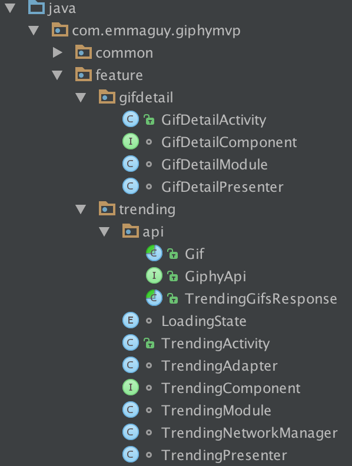

# Giphy RxJava MVP

A showcase of RxJava and Model View Presenter, plus a number of other popular libraries for Android development, including AutoValue, Retrofit, Moshi, and ButterKnife. Unit tested with Mockito covering any business logic. 

The app is a simple master/detail implementation: we retrieve a list of gifs from the Giphy api and present them on the `TrendingActivity` in a `RecyclerView`. When a gif is clicked on, we load it in by itself in the `GifDetailActivity`.
 


## Benefits

This setup has a number of advantages over a non-MVP app architecture
 - it separates our concerns
    - the `Presenter` is view agnostic and does not care how an action was triggered, making a clear division which is easy to change
    - the view which implements the `View` interface is very simple - the methods are usually one liners, doing something on the android `Activity` e.g. just setting a view's state to `View.GONE` - which also makes them easy to test
 - it allows us to place all our business logic within the `Presenter` object and abstracts the `View` for easy mocking, so we can unit test all the things, e.g: 
    - when we're doing a network request, does the loading indicator show when it starts, and hide when it ends?
    - are we ignoring clicks on the 'refresh' button when a network call doing a refresh is already in progress?
    - what happens when a network call fails?
    - ... etc 
 - support for orientation changes (e.g. device rotation) with very little effort
 - the power of rxjava 
    - `Observable`s exposing future actions via the `View` interface, allowing our `Presenter`s to be entirely stateless
    - easy to do long running operations off the main thread
        - in app code but also in the unit tests  

## Architecture

### Packaging

The app is packaged by component/feature, under the `com.emmaguy.giphymvp.feature` package, to keep everything as private as possible. This means that any classes which contain logic for the `trending` feature is contained within `feature.trending` package and cannot be mistakenly used or extended elsewhere.

Each component consists of a `Presenter` class, a `View` interface which the corresponding `Activity` implements and a `Module`/`Component` for dependencies. The components currently map 1-1 to Activities, but could easily use custom views instead.



### View interface

The `View` interface enables the `Presenter` to be pure Java and not have to know about anything android:
```java
    interface View extends PresenterView {
            Observable<Object> onRefreshAction();

            void showLoading();
            void hideLoading();
            ...
        }
```

The interface exposes:
 - actions that the user can perform e.g. clicking a button, swiping, etc. (these are the methods that return `Observable<Object>`) 
    - we subscribe to each of these in the `Presenter`'s one lifecycle method, `onViewAttached`
    - each subscription is added to a `CompositeSubscription` via the method `unsubscribeOnViewDetach`, which will unsubscribe from all subscriptions when the view is detached
    - we limit what the `Presenter` is exposed to by using a return type of `Observable<Void>`, often it's enough just to know the action has happened
 - actions which immediately update the view with a simple operation e.g. show or hide a progress bar (method name will usually starts with `show`/`hide`), or methods which `set` data/state 
 - actions that start another Activity (prefixed with `open` e.g. `openGifDetail`)

### Presenters

Are responsible for presentation of whatever the view has (using a view interface), constrained by some business logic. 

For example, `TrendingPresenter` can react to refreshes. The consequence of a refresh varies depending on whether we successfully retrieve gifs or not, we can either show the grid of gifs or an error. 

While the view introduces two kinds of refresh, loading (a `ProgressBar` centered on screen as there's nothing else to see) and incremental loading (a swipe to refresh view), we have cheated slightly and just set both the loading and incremental loading to hidden after we refresh. The Giphy API does not support pagination, so this is not the place to try and demo incremental loading. We don't need to show incremental errors because we either have no data or some cached. In a real application, it's likely the cache is too stale to show anything useful, but this sample is not that complex!
 
#### TrendingModel

A class containing state, for the moment this is just whether we have some gifs, or whether there's been an error

### Managers

We only have one in this project, `TrendingManager`, which is responsible for managing the network and the cache. We hit the cache - if there's something in it, we go with that. If not, let's refresh and cache it.

An advantage of this separation is that we are able to have unit tests covering the useful logic here - do we actually save gifs in storage when we successfully get some? Do we avoid the network when we use the cache?

### Storage

As you might expect, these classes just persist things. Here we only have `TrendingStorage` which is just an in memory cache of the last list of trending gifs we successfully received. No timestamp or concept of invalidation, just some gifs to show to the user.

## Dependency Injection

This project does not use Dagger, instead it provides the required classes manually.

We instead create simple classes suffixed with `Module` that contain static factory methods that construct the required dependencies, and create interfaces suffixed `Component` which list the injectable items for each `feature`.
 
Example Module:
```java
class TrendingModule {
    private static TrendingPresenter presenter;

    static TrendingPresenter trendingGifsPresenter() {
        return  new TrendingPresenter(trendingGifManager(), AndroidSchedulers.mainThread());
    }
    ....
}

```

Example Component:
```java
interface TrendingComponent extends BaseComponent {
    TrendingPresenter getPresenter();
}
```
 
Then, when the dependencies are needed, we can create the required components using the factory methods. We abstract this into the `BaseActivity`, which also performs the ButterKnife binding/unbinding and `Presenter` lifecycle methods attaching/detaching the view.

```java
@CallSuper @Override protected void onCreate(final Bundle savedInstanceState) {
    super.onCreate(savedInstanceState);

    inject(createComponent());
    setContentView(getLayoutId());
    unbinder = ButterKnife.bind(this);
    onViewCreated(savedInstanceState);
    getPresenter().onViewAttached(getPresenterView());
}
```

We separate the `createComponent` and `inject` steps as an easy way to support orientation change - the first time we call both `create` and `inject`, any subsequent times we need to inject we can just call `inject` and we can reuse the classes - which means we use our memory cache of data from our network requests (held in `TrendingStorage`) rather than hit the network again.
 

# License

    Copyright 2016-2017 Emma Guy

    Licensed under the Apache License, Version 2.0 (the "License");
    you may not use this file except in compliance with the License.
    You may obtain a copy of the License at

       http://www.apache.org/licenses/LICENSE-2.0

    Unless required by applicable law or agreed to in writing, software
    distributed under the License is distributed on an "AS IS" BASIS,
    WITHOUT WARRANTIES OR CONDITIONS OF ANY KIND, either express or implied.
    See the License for the specific language governing permissions and
    limitations under the License.
